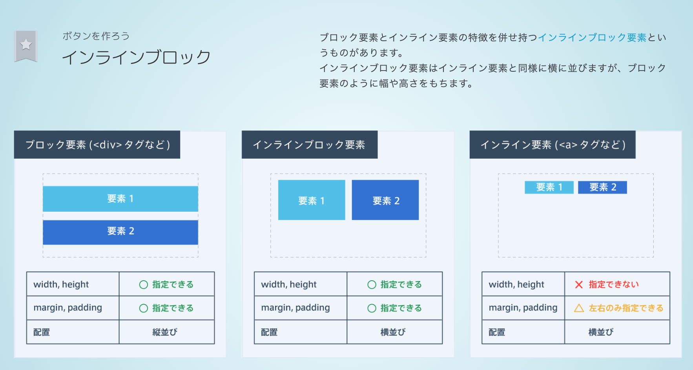
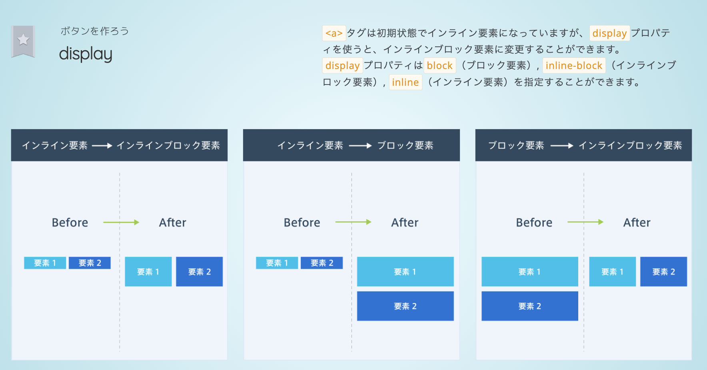
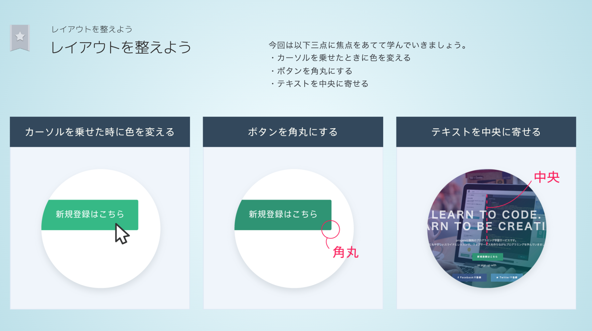
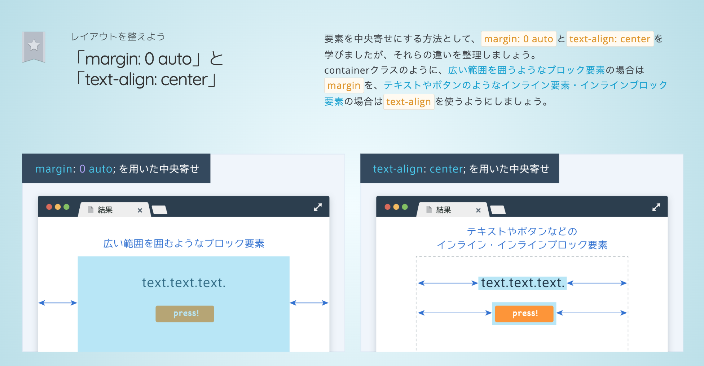
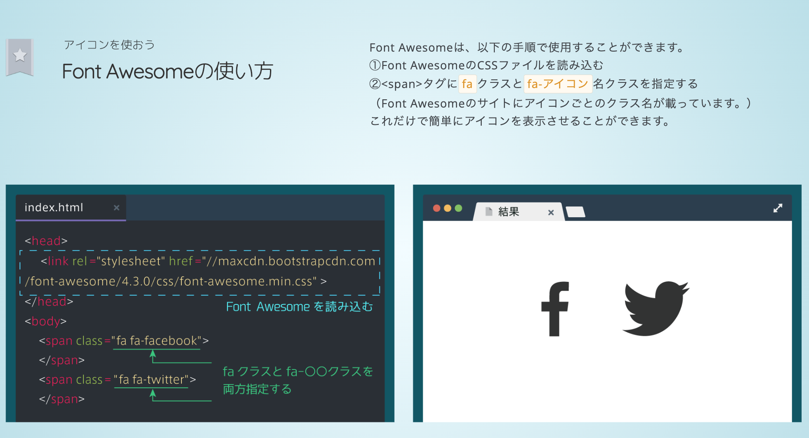
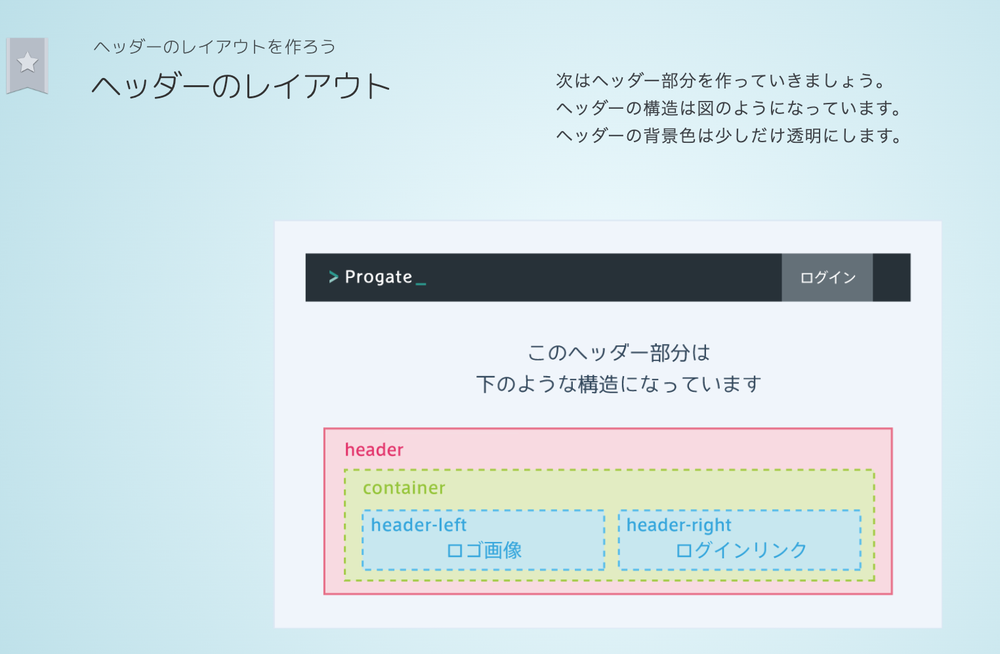
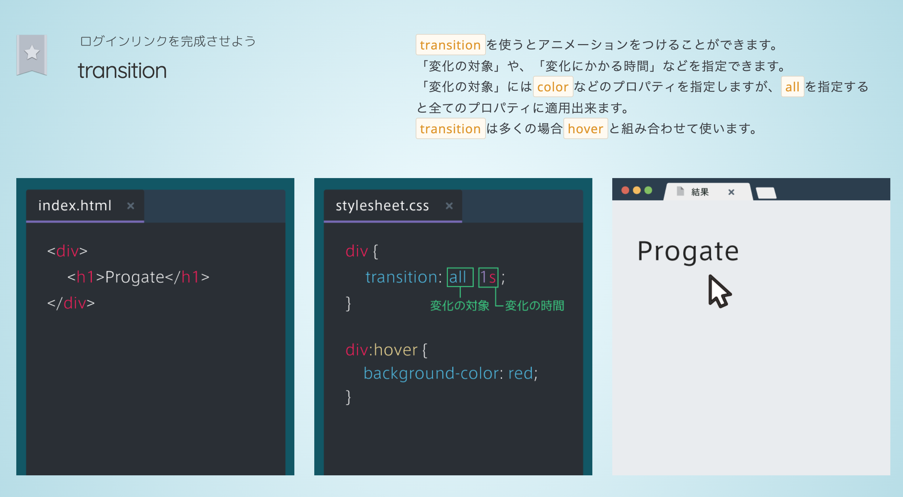

- ボタンは`<a>`タグで指定
  - `<a>`タグはインライン要素
    - インライン要素にはwidthやheight、marginが指定できない

  - `<a>`タグは初期状態でインライン要素になっています
    - displayプロパティを使うと、インラインブロック要素に変更することができます
    - isplayプロパティはblock（ブロック要素）, inline-block（インラインブロック要素）, inline（インライン要素）を指定することができます。

- レイアウトを整えよう
  - カーソルを乗せたときに色を変える
  - ボタンを角丸にする`border-radius`
  - テキストを中央に寄せる`text-align`
  - カーソルが乗ったときの状態をhover

- Font Awesomeの使い方
- ①Font Awesomeのcssを読み込む
- ②``タグにfaクラスとfa-アイコン名クラスを指定する

- ヘッダーのレイアウト

  - opacityとrgba
    - opacityには要素の中身全てを透明にするという性質
    - 背景色のみを透明にするには、rgbaというものを使う
    - opacityは中身の要素も透過
    - rgbaは背景色だけが透過
 - rgb(rgb(200,231,239))
   - 4つ目の値が透明にする度合いで、0 ~ 1の数値で指定
   - 値が小さいほど透明になります
 - rgba(#C9E7EF)
   - 色を透明にしたいときは、

- transition
  - transitionを使うとアニメーションをつけることができる

  - transition:all 1s;
    - transition:変化の対象 変化にかかる時間
    - allを指定するとすべてのプロパティに適用できる
    - transitionは多くの場合hoverと組み合わせて使う

- 行間を指定する
  - line-heightプロパティを使うと、行の高さを指定することができる
  - 値が大きいほど行間が大きくなる
  - 縦方向の中央に文字を配置するのにも使える
  - 要素の高さとline-heightを同じ値にすると、文字が中央に表示される。
- `<a>`タグをクリックできる範囲
  - `<a>`タグをブロック要素にすると、ボタン全体をクリックできる

